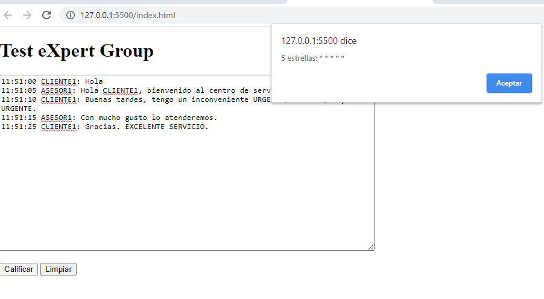
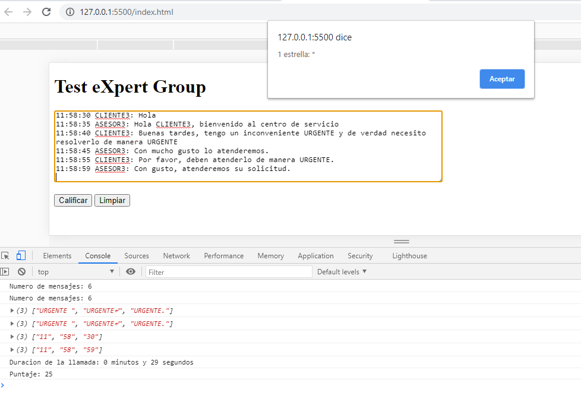

# test_expert
Este repositorio contiene el desarrollo de la prueba técnica de la compañia ExpertGroup, para la vacante de desarrollador

## Solucion
Se desarrollo una solucion utilizando el lenguaje JavaScript, funcionando en una sola pagina (SPA). Se utilizo una clase `Mensaje` con la cual se realizaron todas las operaciones sobre la conversacion sostenida entre el CLIENTE y el ASESOR.

### Modo de Uso
Desde la consola ejecute el siguiente comando:
```
git clone https://github.com/jaarmore/test_expert.git
```

Esto descargara una carpeta a su equipo con el nombre test_expert. Acto seguido ejecute desde su consola:
```
cd test_expert
```
Una vez alli, abra el archivo `index.html` con su editor navegador favorito y pruebe la solucion.


### Aplicacion
La solucion propuesta funciona tomando el texto de la conversacion y pegandolo en el campo de formulario que se presenta al usuario, como se muestra en la imagen abajo.




Adicional tambien puede utilizar la consola del navegador para validar los diferentes mensajes que dan mayor informacion al usuario.



### AUTHOR
**_Jackson Moreno_**
